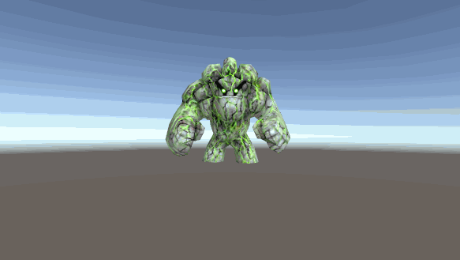

# UnityShaderEffect
Unity shader effect of commonly used
Unity 2018.4.x

### namespace SG

## Unlit

### SpriteGrey

### SpriteOutline

### SprtieSkew

### ImageGrey

### TextureStencil

### UV Animation

### Line Gradient

## 3D

### Distortion

### RimLight

## PostEffect

### Mobile Bloom Effect

# Reference

[Unity-Mobile-Shader](https://github.com/QianMo/Unity-Mobile-Shader)

